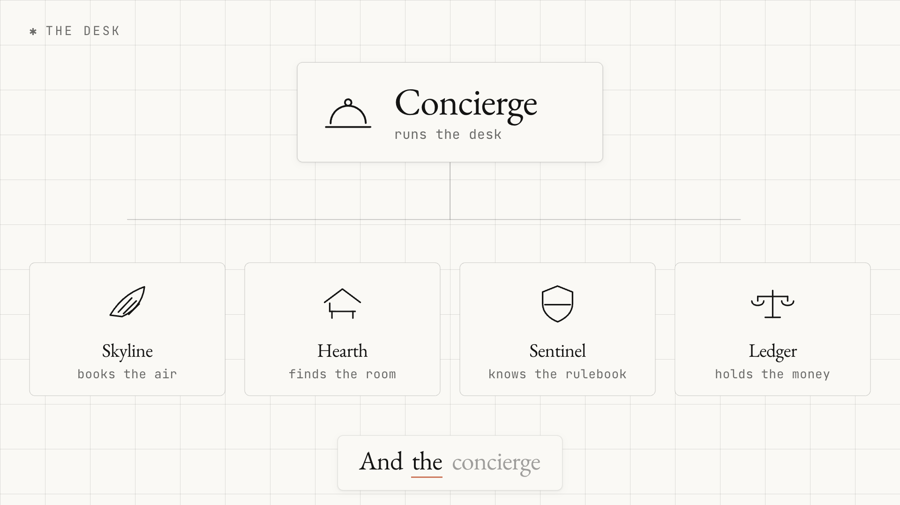

# AtlasTrip

**Five AI agents, five different frameworks, five separate processes, cooperating over the [Agent2Agent (A2A) protocol](https://a2a-protocol.org) to book a corporate trip.**

The agents share no runtime and no library. They cannot import each other; their dependency trees are mutually incompatible on purpose. They share a protocol, and that turns out to be enough.

```
                          you
                           │  A2A
                           ▼
                 ┌───────────────────┐
                 │     Concierge     │  LangGraph      :8000
                 │   (orchestrator)  │
                 └─────────┬─────────┘
                           │  A2A: one context id, four peers
        ┌──────────┬───────┴───────┬─────────────┐
        ▼          ▼               ▼             ▼
  ┌──────────┐┌──────────┐  ┌────────────┐┌────────────┐
  │ Skyline  ││  Hearth  │  │  Sentinel  ││   Ledger   │
  │  flights ││ lodging  │  │   policy   ││   budget   │
  │Google ADK││  CrewAI  │  │ LlamaIndex ││ Pydantic AI│
  │   :8001  ││  :8002   │  │   :8003    ││   :8004    │
  └─────┬────┘└─────┬────┘  └──────┬─────┘└──────┬─────┘
        └───────────┴──────┬───────┴─────────────┘
                           │  MCP (streamable HTTP)
                 ┌───────────────────┐
                 │ Travel Inventory  │  :8100
                 │    MCP server     │
                 └─────────┬─────────┘
                ┌──────────┴──────────┐
           PostgreSQL              TinyDB
      flights, hotels,          policy clauses,
      people, budgets,          entry rules,
      A2A task store            audit trail
```

<p align="center">
  
</p>

Two protocols, two jobs:

- **MCP gives an agent its tools.** One inventory server holds every tool that touches data. All four specialists connect to it, each through its own framework's MCP client.
- **A2A lets agents give each other work.** The Concierge commissions the specialists, waits on them, renegotiates with them, and pauses the whole network when a human has to decide.

---

## The 90 second version

<p align="center">
  <a href="https://github.com/fnusatvik07/a2a-multi-agent-travel/raw/main/docs/media/atlastrip-explainer.mp4">
    
  </a>
</p>

<p align="center">
  <a href="https://github.com/fnusatvik07/a2a-multi-agent-travel/raw/main/docs/media/atlastrip-explainer.mp4"><b>Watch the explainer</b></a>
  &nbsp;·&nbsp; 2 min 37 &nbsp;·&nbsp; narrated
</p>

A company needs one engineer in Tokyo, which is four separate decisions. Five
agents take them, on five frameworks that cannot share a process. You watch the
messages travel between them, watch Sentinel refuse a room Hearth had already
chosen, and watch Ledger stop dead rather than spend money without a human.

Every figure on screen comes from an actual run of the network. The composition
that produced it is in
[`videos/atlastrip-a2a-explainer/`](videos/atlastrip-a2a-explainer) and rebuilds
with `npx hyperframes render`.

## Table of contents

- [The 90 second version](#the-90-second-version)
- [The scenario](#the-scenario)
- [Quick start](#quick-start)
- [What a run looks like](#what-a-run-looks-like)
- [The five agents](#the-five-agents)
- [How A2A is actually used](#how-a2a-is-actually-used)
- [How MCP is actually used](#how-mcp-is-actually-used)
- [Repository layout](#repository-layout)
- [The dataset](#the-dataset)
- [Running without an API key](#running-without-an-api-key)
- [Tests](#tests)
- [Design decisions worth arguing about](#design-decisions-worth-arguing-about)
- [Troubleshooting](#troubleshooting)
- [Versions](#versions)
- [License](#license)

---

## The scenario

Nimbus Robotics is a fictional company whose travel desk is staffed entirely by agents. An engineer types one sentence:

> Mira Halvorsen needs to be at the Kaisei Robotics quarterly business review in Tokyo from 14 October 2026 to 17 October 2026.

What happens next is not a single model with ten tools. It is five agents with different jobs, different opinions, and a disagreement to resolve.

1. **Concierge** reads the sentence, resolves Mira in the directory, and commissions two agents at once.
2. **Skyline** searches live fare inventory. The flight is eleven hours, so it offers premium economy where the fare is within a defensible multiple of economy. It does not know whether Mira is *allowed* premium economy, and says so on its own agent card.
3. **Hearth** searches lodging. The nearest hotel to the customer's office is $298 a night against a $280 cap. Hearth takes it anyway, because it is 210 metres from the front door, and flags that it went over.
4. **Sentinel** screens the assembled trip against the corporate travel policy and the entry rulebook. It rules the hotel a violation of clause TRV-003 and states the cap in its finding.
5. **Concierge** does not overrule anybody. It goes back to Hearth with the cap as a hard constraint. Hearth returns a compliant room 560 metres away. Sentinel screens again and clears it.
6. **Ledger** checks the cost centre. The trip fits the remaining budget but is over the $3,000 auto-approval threshold, so it moves its A2A task into `input-required` and stops.
7. That pause **propagates**. The Concierge's own task goes to `input-required` too, and the person who asked for the trip sees the question.
8. On approval, both tasks resume where they left off, Ledger commits the money to Postgres, and the itinerary is written.

The interesting part is step 5. Hearth made a defensible judgement, Sentinel overruled it, and the network resolved the disagreement by negotiating rather than by one agent quietly knowing better. That only works because judgement and enforcement live in different agents that can talk to each other.

<p align="center">
  
</p>

---

## Quick start

**You need:** Python 3.11 or newer, [uv](https://docs.astral.sh/uv/getting-started/installation/), Docker, and an OpenAI API key.

```bash
git clone https://github.com/fnusatvik07/a2a-multi-agent-travel.git
cd a2a-multi-agent-travel

cp .env.example .env          # then put your OPENAI_API_KEY in it

make install                  # one virtualenv per service (about 2 minutes)
make db                       # Postgres in Docker on port 5433
make seed                     # build the dataset

make run                      # starts the MCP server and all five agents
```

Then, in a second terminal:

```bash
make demo                     # plan the sample trip
```

Other things to try:

```bash
make doctor                              # is everything up?
make cards                               # read all five agent cards
make trail                               # replay what crossed the wire
make plan REQUEST="Deshawn Okafor needs three days in London next month"
make test                                # 88 unit tests, 70 integration tests
```

`make` on its own lists every target.

---

## What a run looks like

This is real output, trimmed only for width.

```
──────────────────────────────────────────────────────────────────────────────
The network at work
  · Planning TRIP-990D73F8.
  · Understood: Mira Halvorsen (IC5), SFO to HND, 2026-10-14 to 2026-10-17.
  · Skyline: UA 837 / UA 838 in premium economy, $3,110.48.
  · Hearth: Shinagawa Bay Tower, $298.33 a night, $894.99.
  · Sentinel: This trip cannot proceed as booked because the lodging cost
    exceeds the Tokyo nightly cap and the total is above the auto-approval
    threshold.
  · violation: TRV-003 Shinagawa Bay Tower is $298.33 a night against a Tokyo
    cap of $280.00, an overage of $18.33 a night ($54.99 across 3 nights).
  · warning: TRV-005 Trip total $4,013.87 is at or above the $3,000.00
    auto-approval threshold.
  · Re-asked Hearth with the $280.00 cap enforced: Konan Garden Hotel,
    $189.96 a night, $569.88.
  · Sentinel: Your trip to Tokyo is within policy and can proceed once your
    manager approves it.
  · Ledger: needs_approval. The requested trip costs $3,688.76, and the cost
    centre currently has $7,600.00 remaining for the quarter.

──────────────────────────────────────────────────────────────────────────────
Approval required
  Approve $3,688.76 against CC-ROBOTICS-APAC?
  This needs elena.marchetti@nimbusrobotics.example.

  Approve this spend? [y/N] y

──────────────────────────────────────────────────────────────────────────────
Resumed
  · Approval received. Returning to Ledger.
  · Ledger: approved. This leaves $3,911.24 remaining in the quarterly budget.
  · Itinerary confirmed, $3,688.76.

──────────────────────────────────────────────────────────────────────────────
TRIP-990D73F8  CONFIRMED
  flights   UA 837 SFO-HND 14 Oct 17:55Z, UA 838 back 17 Oct 06:30Z
            premium economy, $3,110.48
  stay      Konan Garden Hotel (3*), 0.56 km from the venue
            3 nights at $189.96, $569.88
  warning   TRV-005 Trip authorisation threshold
  info      TRV-010 Entry documentation
  approved  AUTH-351693FF2A, $3,911.24 left in CC-ROBOTICS-APAC
  total     $3,688.76
```

`make trail` then replays the same run as protocol traffic:

```
  17:56:15  concierge   inbound    received   Mira Halvorsen needs to be at ...
  17:56:17  concierge   outbound   asked      concierge -> skyline
  17:56:17  concierge   outbound   asked      concierge -> hearth
  17:56:25  hearth      inbound    completed  Shinagawa Bay Tower $894.99
  17:56:31  skyline     inbound    completed  $3,110.48 round trip
  17:56:42  sentinel    inbound    completed  cannot proceed as booked ...
  17:56:42  concierge   outbound   asked      concierge -> hearth
  17:56:48  hearth      inbound    completed  Konan Garden Hotel $569.88
  17:56:57  sentinel    inbound    completed  within policy, approval needed
  17:57:00  ledger      inbound    escalated  awaiting approval for $3,688.76
  17:57:00  concierge   inbound    escalated  Approve $3,688.76 ...
```

Every line is one A2A exchange, and every line carries the same context id.

---

## The five agents

| Agent | Framework | Job | Why that framework |
|---|---|---|---|
| **Concierge** `:8000` | LangGraph | Orchestrates the trip and talks to the traveller | Booking a trip is a workflow with a fan-out, a compliance gate and a human interrupt, not an open-ended chat. An explicit `StateGraph` makes that shape visible, and LangGraph's `interrupt` maps one-to-one onto A2A's `input-required`. |
| **Skyline** `:8001` | Google ADK | Sources and ranks flights | ADK's `McpToolset` connects an agent to an MCP server in three lines, so the model can browse the live timetable itself rather than being handed a fixed list. |
| **Hearth** `:8002` | CrewAI | Sources lodging | The one place where a small crew beats a single model: a Scout describes what is on offer, a Negotiator makes the call and owns the trade-off. `output_pydantic` validates the crew's answer before it leaves. |
| **Sentinel** `:8003` | LlamaIndex | Rules on policy and entry requirements | The travel policy is prose. LlamaIndex indexes the clause text and retrieves what bears on this trip, which is exactly what it is for. |
| **Ledger** `:8004` | Pydantic AI | Authorises spend against a cost centre | A typed answer, enforced by the framework. `output_type=SpendOpinion` means the model cannot return an essay where a decision was asked for. |

Every agent has the same four files, so once you have read one you can read any of them:

```
agents/<name>/src/<pkg>/
    card.py        what the agent advertises on its Agent Card
    service.py     the domain logic, deterministic, no model involved
    agent.py       the framework wiring, where the model actually reasons
    executor.py    the A2A lifecycle, written out in full
    __main__.py    put it on a port
```

### The split between `service.py` and `agent.py`

This is the most important design decision in the repository, so it is worth stating plainly.

**`service.py` decides. `agent.py` judges and explains.**

- Skyline's service ranks fares and assembles the proposal. Its ADK agent chooses one from the shortlist. If the model names a flight that does not exist, the choice is discarded and the ranking ships. A model can have an opinion; it cannot quote an unbookable itinerary.
- Sentinel's `rules.py` evaluates the structured half of each policy clause in ordinary Python. That ruling is binding. Its LlamaIndex agent retrieves the clause text and writes the explanation. A traveller is never stopped, or waved through, because a model paraphrased a paragraph.
- Ledger's service decides whether money moves and writes the commitment. Its Pydantic AI agent writes the reasoning a manager reads. An optimistic model cannot spend anything.

Every framework call is wrapped so that a failure, a missing API key or an unusable answer degrades to the deterministic path instead of taking the network down.

---

## How A2A is actually used

Not a checklist of features, but what the protocol is doing here and where to read it.

### Agent Cards, and discovery

Every agent serves a card at `/.well-known/agent-card.json`. It is the only thing a caller needs: the interface list gives the transports and URLs, the skill list gives the operations.

```bash
curl -s http://127.0.0.1:8001/.well-known/agent-card.json | jq
```

Nothing on the Concierge's card says "this one orchestrates the others". To a caller it is simply an agent that can plan a trip. Read `packages/atlastrip_core/src/atlastrip_core/a2a_support.py` for how a card is built, and any agent's `card.py` for what goes on it.

### The task lifecycle

A2A models work as a task with a state, not as a request and a response. Every executor in this repository walks the same path, written out in full rather than hidden behind a base class:

```
Task(submitted) ──▶ working ──▶ working ──▶ artifact ──▶ completed
                                                     └─▶ failed
                                                     └─▶ input-required ──▶ (resume)
```

<p align="center">
  
</p>

One detail worth knowing before you write your own: **the first thing enqueued must be the `Task` object itself.** A status update that arrives before it is rejected by the client. That is what `accept_task` exists for.

Read `agents/skyline_adk/src/skyline_adk/executor.py` for the shortest complete example.

### Structured artifacts

Agents here exchange validated JSON, not prose. Each result is published as an A2A `DataPart` alongside a text part written for a human, so one message serves both the machine and the person watching.

The shapes live in one shared package, `atlastrip_core.models`. Those pydantic models are the whole contract between the agents. They share nothing else.

### One context id per trip

Every call the Concierge makes carries the same `contextId`. Five processes, one conversation, and an audit trail that reads as a single story. That is what `make trail` prints.

### Interrupting, and resuming

Ledger cannot approve a $3,688 trip on its own. Rather than failing, it moves the task to `input-required` and returns. The task is not finished; it is waiting.

The Concierge, holding its own task open for the traveller, sees the pause and moves *its* task to `input-required` too. The interruption travels from the agent that needs the answer, through the orchestrator, out to the person who can give it. No agent in that chain special-cases the others.

On approval, a second message is sent **on the same task id**, the executor runs again with the token present, and the task completes.

- `agents/ledger_pydanticai/src/ledger_pydanticai/executor.py` raises the pause
- `agents/concierge_langgraph/src/concierge_langgraph/executor.py` forwards it
- `tests/network/test_specialists.py::test_the_approval_settles_the_same_task` pins it down

### Task state in Postgres

Every agent uses the SDK's `DatabaseTaskStore` against the same Postgres database, so `GetTask` still answers for a task accepted before the process was last restarted. This matters most for Ledger, whose tasks can outlive the process while a human thinks about them.

### Version negotiation, and the method names

A2A 1.0 renamed the JSON-RPC methods to match the gRPC service. `SendMessage`, not `message/send`. Most material written before the 1.0 spec shows the old names.

These agents enable compatibility mode, so both spellings work. The catch, which costs an hour if you meet it unprepared: **with compatibility enabled, a request that does not send an `A2A-Version: 1.0` header is treated as 0.3.**

```bash
curl -s http://127.0.0.1:8001/a2a/jsonrpc \
  -H 'Content-Type: application/json' \
  -H 'Accept: application/json, text/event-stream' \
  -H 'A2A-Version: 1.0' \
  -d '{"jsonrpc":"2.0","id":1,"method":"GetTask","params":{"id":"..."}}'
```

`tests/network/test_protocol.py` exercises all of this with no client library at all, so the repository shows the wire format and not just the Python wrapper.

---

## How MCP is actually used

One MCP server, `mcp_servers/travel_inventory`, holds every tool that touches data:

| Tool | Returns |
|---|---|
| `search_flights` | Bookable fares for a city pair on one local departure date |
| `search_hotels` | Rooms in a city, with distance to a customer site |
| `get_ground_transport` | Airport transfer options |
| `lookup_employee` | Grade, passport, cost centre, manager |
| `lookup_venue` | A customer site and its coordinates |
| `get_cost_center_budget` | Allowance, committed, remaining |
| `record_commitment` | Writes money to the ledger |
| `list_airports` | The airports with inventory |

All four specialists read that one server, each through its own framework's MCP client:

```python
# Google ADK
McpToolset(connection_params=StreamableHTTPConnectionParams(url=MCP_URL))

# CrewAI
MCPServerAdapter({"url": MCP_URL, "transport": "streamable-http"})

# LlamaIndex
McpToolSpec(client=BasicMCPClient(MCP_URL))

# Pydantic AI
MCPToolset(MCP_URL)
```

Because the tools live outside every agent, swapping a framework never means rewriting a tool.

There is also a fifth client: `packages/atlastrip_core/src/atlastrip_core/mcp_http.py`, about 150 lines of `httpx` that speaks the streamable HTTP transport directly. It exists for a practical reason and a pedagogical one. The practical reason is that the four frameworks pin three mutually incompatible versions of the `mcp` package, and shared code cannot join that argument. The pedagogical one is that MCP is a small protocol, and seeing it unwrapped is more useful than seeing it wrapped:

1. `POST` an `initialize` request; the response header carries a session id
2. `POST` a `notifications/initialized` notification
3. `POST` `tools/call` for as long as you like

---

## Repository layout

```
a2a-multi-agent-travel/
├── agents/
│   ├── concierge_langgraph/     the orchestrator
│   ├── skyline_adk/             flights
│   ├── hearth_crewai/           lodging
│   ├── sentinel_llamaindex/     policy and entry rules
│   └── ledger_pydanticai/       budget and approvals
├── mcp_servers/
│   └── travel_inventory/        the one MCP server everyone reads
├── packages/
│   └── atlastrip_core/          the only shared code: models, storage, A2A glue
├── data/
│   ├── seed/                    the dataset, as editable JSON
│   └── tinydb/                  policy documents and the audit trail
├── scripts/
│   ├── install.sh               one virtualenv per service
│   ├── seed_data.py             build the dataset
│   ├── run_network.sh           start everything
│   ├── run_tests.sh             each suite in its own environment
│   └── atlastrip.py             the CLI
├── tests/
│   ├── core/                    the shared package
│   ├── agents/                  one suite per agent, run in its own venv
│   └── network/                 integration, against the running network
└── docs/
    ├── ARCHITECTURE.md          the deeper walk-through
    ├── DATASET.md               what is in the data and how to change it
    └── diagrams/                draw.io sources and rendered SVGs
```

### Why one virtualenv per service

Not for tidiness. Because a single shared environment **cannot exist**:

- CrewAI needs `openai<3`; Pydantic AI needs `openai>=3`
- Google ADK needs `mcp<2`; LlamaIndex has moved to `mcp>=2`

`uv pip install` refuses to resolve them together, and it is right to. This is exactly the situation A2A exists for: when agents cannot share a process, they can still share a protocol. `scripts/install.sh` builds seven environments in about two minutes.

---

## The dataset

Hand-authored where a person should be able to read and edit it, generated where volume is needed. Everything is seeded, so two runs produce identical output.

**PostgreSQL** holds what is relational:

| Table | Rows | Notes |
|---|---|---|
| `flights` | 1,938 | 5 routes, real carriers, 2 to 3 fare products per cabin per day |
| `hotel_rates` | 6,042 | 19 hotels, 3 room types, every night from September to December 2026 |
| `hotels` | 19 | Tokyo, London, Singapore, San Francisco, New York, with coordinates |
| `employees` | 6 | Grade, passport country, cost centre, manager |
| `cost_centers` | 4 | Quarterly budget |
| `budget_ledger` | 11 | Opening commitments, so budgets are already partly spent |
| `airports`, `ground_transport` | 23 | |
| `a2a_tasks` | live | Created and owned by the A2A SDK |

**TinyDB** holds what reads like documents:

- `policies.json`: 10 travel policy clauses. Each carries `text` (prose, which Sentinel's vector index is built from) and `rule` (a structured description of the same clause, which `rules.py` evaluates). Retrieval decides which clauses are worth *explaining*; the structured rule decides which are *broken*.
- `visa_rules.json`: 12 passport and destination pairs with processing times.
- `venues.json`: 5 customer sites with coordinates, so lodging can be ranked by walking distance.
- `audit_<service>.json`: the runtime trail. One file per writer, because TinyDB hands out sequential document ids in memory and two processes writing one file will collide.

Edit anything in `data/seed/` and run `make seed`. See [docs/DATASET.md](docs/DATASET.md).

The scenario is tuned so the interesting things happen: the nearest Tokyo hotel is $298 against a $280 cap, and the trip lands at $3,689 against a $3,000 approval threshold with $7,600 left in the quarter. Change `data/seed/hotels.json` or `data/seed/policies.json` and the negotiation changes with it.

---

## Running without an API key

Set `ATLASTRIP_REASONING=deterministic` in `.env`. Every agent then skips its model and runs its own `service.py` directly. The A2A traffic, the MCP calls, the task lifecycle, the interrupt and the database writes are all unchanged; only the judgement and the prose are gone.

This is what the unit tests use, which is why they run offline and for free.

The one thing that needs a model is the Concierge's intake, since something has to turn a sentence into two ISO dates. In deterministic mode it falls back to a crude parser that recognises a city name and assumes a three night trip four weeks out.

---

## Tests

```bash
make test          # everything: 158 tests
make test-unit     # 88 tests, offline, no API key, about 2 seconds
make test-network  # 70 tests against the running network, about 4 minutes
```

There is no single pytest run, because there is no environment that can import all five agents at once. `scripts/run_tests.sh` runs each suite inside the virtualenv of the thing it tests. The integration suite skips itself with a clear message when the network is not up.

What the integration tests actually assert:

- every card is reachable, advertises its skill and offers both HTTP bindings
- a task walks submitted, working, artifact, completed
- a malformed brief is `rejected` (the caller was wrong), an empty route is `failed` (the work could not be done)
- the raw JSON-RPC binding answers with no client library present, in both 1.0 and 0.3 spellings
- Hearth exceeds the cap on judgement and respects it when told to enforce it
- Sentinel catches the room Hearth chose, and clears the replacement
- Ledger pauses, and the approval settles the same task id
- one sentence produces a confirmed itinerary, with all five agents in the trail and Hearth asked twice
- declining the approval leaves the ledger untouched

The network suite restores the seeded budget ledger at session start and removes its own commitments after each test, so runs do not drift.

---

## Design decisions worth arguing about

Honest notes on the choices a reader might push back on.

**The Concierge is not a policy engine.** It passes the nightly cap to Hearth as guidance and lets Hearth exceed it, then acts on Sentinel's ruling. A simpler design would have the orchestrator enforce the cap up front and skip a round trip. That design has no negotiation in it, and negotiation between independently-owned agents is the thing worth demonstrating. The Concierge reads the cap back out of Sentinel's finding text rather than holding a copy of the policy.

**The renegotiation happens exactly once.** A cap nobody can meet would otherwise loop between two agents forever. See `graph.after_screen`.

**The approval token is a correlation id, not a credential.** Ledger derives it from the trip and the amount, so replaying an authorisation cannot mint a second one and re-costing the trip invalidates the old approval. It is not a security boundary. In production this would be a signed grant from an identity provider, and Ledger would verify the signature.

**The LangGraph checkpointer is in memory.** Restart the Concierge mid-approval and the graph state is gone, though the A2A task in Postgres survives. Swapping `MemorySaver` for the Postgres checkpointer would fix it; it is left simple because the checkpointer is not what the project is about.

**Every model call can fail without consequence.** That is deliberate, and it is why the split between `service.py` and `agent.py` exists. It also means you can watch the network run correctly with the API key removed, which is a useful thing to be able to demonstrate.

**Hearth's ranking uses real units, not normalised scores.** An earlier version min-max normalised price, distance and stars. A test caught that this is scale-blind: it would pay $900 a night to save 400 metres, because it only ever saw "most expensive" and "nearest" rather than how much more and how much nearer. The ranking now scores price as a premium over the cheapest room and distance in kilometres. `tests/agents/hearth/test_ranking.py` keeps it honest.

---

## Troubleshooting

**`make doctor` says an agent is down.** Look in `logs/<agent>.log`. The most common cause on a first run is that `make db` and `make seed` have not been run.

**`Method not found` from a `curl` against an agent.** You are probably sending `message/send` without an `A2A-Version` header, or `SendMessage` with one pointed at 0.3. See [version negotiation](#version-negotiation-and-the-method-names).

**`Agent should enqueue Task before TaskStatusUpdateEvent`.** Your executor published a status update before the `Task` object. Call `accept_task` first.

**Port already in use.** The agents use 8000 to 8004, and the MCP server uses 8100. Postgres is on 5433 rather than 5432 so it never collides with a local install. Change the ports in `packages/atlastrip_core/src/atlastrip_core/registry.py`.

**Ledger rejects everything.** The cost centre budget has been spent by earlier runs. `make reset` puts the dataset back.

**`ModuleNotFoundError: atlastrip_core`, in every environment at once, on macOS.** Editable installs work through a `.pth` file in `site-packages`, and CPython's `site.py` silently skips any `.pth` file carrying the macOS `hidden` flag. Some setups set that flag on dot-prefixed files: iCloud Desktop and Documents sync does it, and so do several endpoint management agents.

Diagnose it with `ls -lO <venv>/lib/python3.12/site-packages/*.pth`. The flag column reads `hidden` when this has happened. Clear it with:

```bash
./scripts/_unhide_pth.sh
```

Every entry point already does this for you, and the `make` targets and run scripts additionally set `PYTHONPATH` so the imports work even if the flag comes back mid-run. If you invoke a virtualenv's Python directly and hit this, go through `make` instead.

---

## Versions

Pinned and verified against these, in August 2026:

| | |
|---|---|
| `a2a-sdk` | 1.1.2, implementing A2A spec 1.0 with 0.3 compatibility |
| `mcp` | 2.1.1 server side, 1.x and 2.x clients depending on the framework |
| `google-adk` | 2.8.0 |
| `crewai` | 1.15.17 |
| `langgraph` / `langchain` | 1.2.11 / 1.3.17 |
| `llama-index-core` | 0.14.24 |
| `pydantic-ai-slim` | 2.35.1 |
| Python | 3.12 |
| Model | `gpt-4.1-mini` by default, the same for all five agents |

All five agents deliberately use the same model, so any behavioural difference you see between them comes from the framework rather than the model. Change `ATLASTRIP_MODEL` in `.env` to use another.

---

## Further reading

- [docs/ARCHITECTURE.md](docs/ARCHITECTURE.md): the walk-through, node by node
- [docs/DATASET.md](docs/DATASET.md): what is in the data and how to change it
- [docs/diagrams/](docs/diagrams/): draw.io sources, and how to regenerate them
- [A2A protocol specification](https://a2a-protocol.org/latest/specification/)
- [a2a-python SDK](https://github.com/a2aproject/a2a-python)
- [Model Context Protocol](https://modelcontextprotocol.io)

## License

MIT. See [LICENSE](LICENSE).
